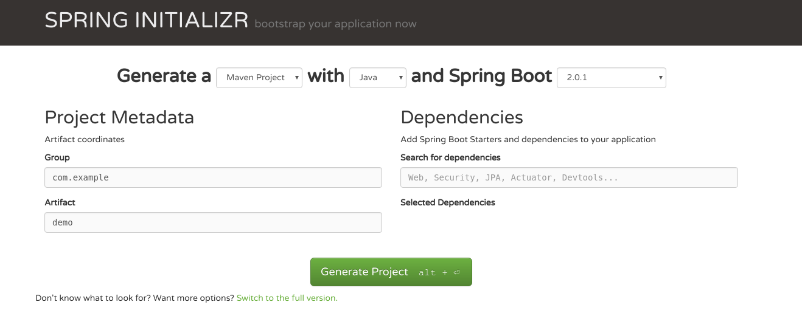

# Créer un projet Spring Boot
 
 
## A la main avec Maven

Deux options :

* Option 1 : Définir un projet parent `spring-boot-starter-parent`

```xml
<parent>
    <groupId>org.springframework.boot</groupId>
    <artifactId>spring-boot-starter-parent</artifactId>
    <version>${spring-boot.version}</version>
</parent>
```

* Option 2 : Une dépendance en scope `import`::

```xml
<dependencyManagement>
    <dependencies>
        <dependency>
            <groupId>org.springframework.boot</groupId>
            <artifactId>spring-boot-dependencies</artifactId>
            <version>${spring-boot.version}</version>
            <type>pom</type>
            <scope>import</scope>
        </dependency>
    </dependencies>
</dependencyManagement>
```

Pour créer une application Web, ajouter une dépendance vers le projet `spring-boot-starter-web`.

```xml
<dependencies>
    <dependency>
        <groupId>org.springframework.boot</groupId>
        <artifactId>spring-boot-starter-web</artifactId>
    </dependency>
</dependencies>
```

## En ligne

Via le site : https://start.spring.io/



## Via des IDE

Spring Tool Suite : `File > New > Spring Starter Project`.

